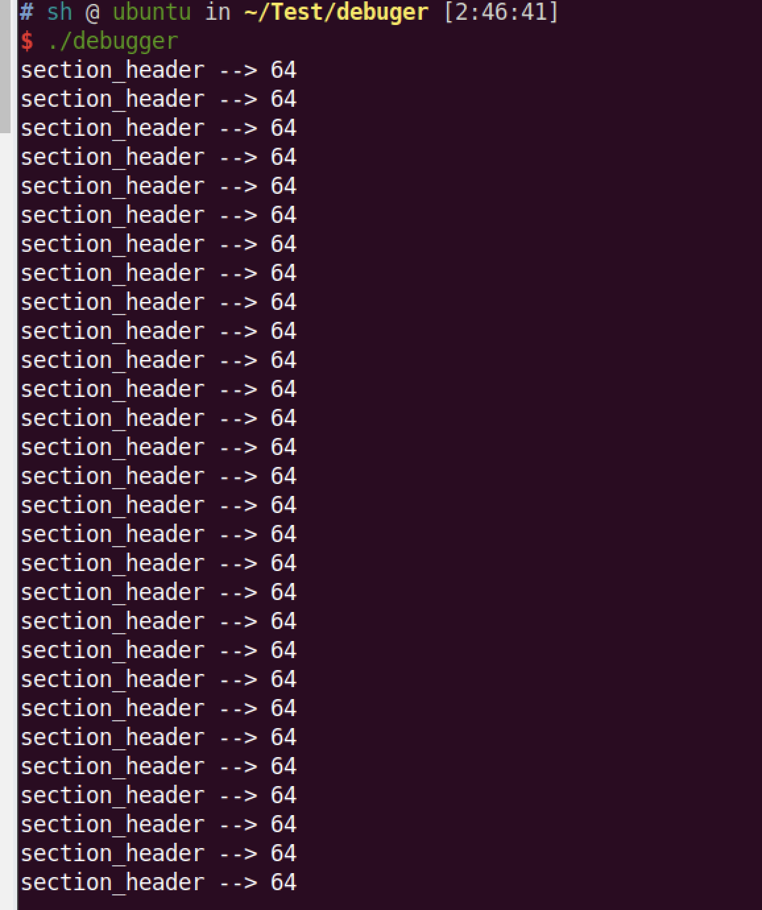
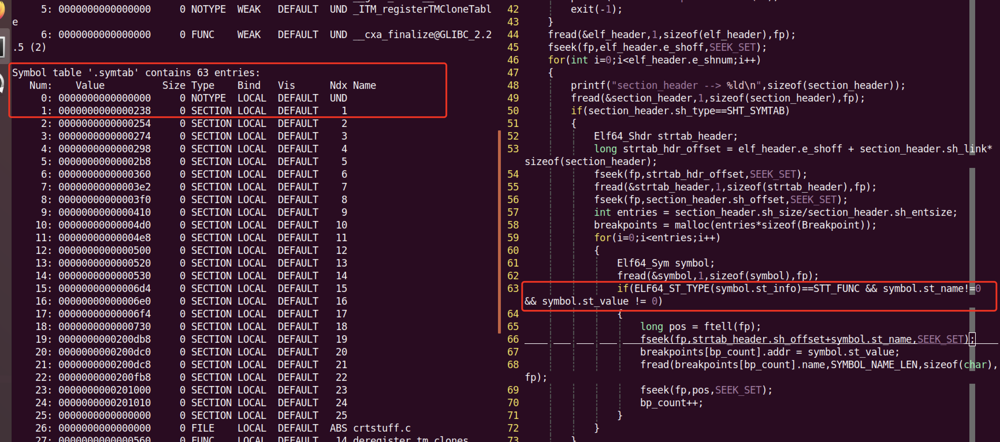

# debugger

> 比赛的时候突然听sakura教练说起实现一个debugger，感觉挺有兴趣的，比赛完放下手中的活，赶紧来搞一搞。

## PTRACE

linux调试器必备的应该就是ptrace了，它使得我们可以读写一个进程的内存，而且当被调用进程发出信号或者进行系统调用的时候我们也可以利用ptrace进行接收。

> From man:
>
> ```
> long ptrace(enum __ptrace_request request, pid_t pid, void *addr, void *data);
> 
> The ptrace() system call provides a means by which one process (the "tracer") may 
> observe and control the execution of another process (the "tracee"), and examine 
> and change the tracee's memory and registers. It is primarily used to implement 
> breakpoint debugging and system call tracing.
> ```

## Simple tracer

> 调试器其实很复杂，这个调试器就是一个简单的学习，所以其定位是调试简单的带符号的ELF文件，同时必须是built for x64 architecture

~~~c
child_pid = fork();
if(child_pid == 0) // child process
{
    ptrace(PTRACE_TRACEME, 0, NULL, NULL);
    execl(argv[1], argv[1], NULL);
    printf("Failed to execl!!\n");
    exit(-1);
}
~~~

* PTRACE_TRACEME 参数：本进程被其父进程所跟踪。其父进程应该希望跟踪子进程。
* execl执行的是我们要调试的程序，这个系统调用会使得调用程序完全替代这个子进程，从而通过调试子进程的方式实现了。

~~~c
wait(NULL);
prepare_breakpoints();
trace();
~~~

wait函数的功能：

> 函数功能是：父进程一旦调用了wait就立即阻塞自己，由wait自动分析是否当前进程的某个子进程已经退出，如果让它找到了这样一个已经变成僵尸的子进程，wait就会收集这个子进程的信息，并把它彻底销毁后返回；如果没有找到这样一个子进程，wait就会一直阻塞在这里，直到有一个出现为止。

父进程肯定是要等待子进程的call TRACEME 并且准备断电，以便进行跟踪调试。

~~~c
void prepare_breakpoints()
{
    parse_elf_file();
    insert_brakepoints();
}
~~~

为了实现断点，我们必须知道子进程函数的起始地址，并插入断点，所以我们需要包含ELF文件的符号表（上面说了，要调试的elf都是没有去符号的奥）。

下面的对比着随便一个64位elf 用readelf -a 配合结构体定义，很容易理解的。

~~~c
void parse_elf_file()
{
    Elf64_Ehdr elf_header;
    Elf64_Shdr section_header;
    fp = fopen(filename, "r");
    if(!fp)
    {
        printf("Failed to open ELF file!\n");
        exit(-1);
    }
    
    fread(&elf_header, 1, sizeof(elf_header), fp);  // read elf header

    fseek(fp, elf_header.e_shoff, SEEK_SET);    // skip to section headers

    for(int i = 0; i < elf_header.e_shnum; ++i) // iterate through headers
    {
        fread(&section_header, 1, sizeof(section_header), fp);  // read section header
        if(section_header.sh_type == SHT_SYMTAB)    // check if this section is symbol table
        {
            
            Elf64_Shdr strtab_header;   // we need to get strtab associated with this symtab to get functions names
            long strtab_hdr_offset = elf_header.e_shoff+section_header.sh_link*sizeof(section_header); // calculate offset to strtab header
            fseek(fp, strtab_hdr_offset, SEEK_SET);
            fread(&strtab_header, 1, sizeof(strtab_header), fp);    // read strtab header
            fseek(fp, section_header.sh_offset, SEEK_SET);

            int entries = section_header.sh_size / section_header.sh_entsize;
            breakpoints = malloc(entries*sizeof(Breakpoint));   // there are more entries than just functions

            for(i = 0; i < entries; ++i)
            {
                Elf64_Sym symbol;
                fread(&symbol, 1, sizeof(symbol), fp);          // read symbol
                if(ELF64_ST_TYPE(symbol.st_info) == STT_FUNC    // symbol is a function
                    && symbol.st_name != 0                      // symbol has name
                    && symbol.st_value != 0)                    // symbol has address within binary
                {
                    
                    long pos = ftell(fp);
                    fseek(fp, strtab_header.sh_offset+symbol.st_name, SEEK_SET);

                    breakpoints[bp_count].addr = symbol.st_value;   // get address to beginning of function
                    fread(breakpoints[bp_count].name, SYMBOL_NAME_LEN, sizeof(char), fp);   // get function name

                    fseek(fp, pos, SEEK_SET);
                    bp_count++;
                }
            }
        }
    }
}
~~~

在linux 里面定义了很多结构体，来帮我们截图文件头等一些必要的东西。

~~~c
typedef struct
{
  unsigned char    e_ident[EI_NIDENT];    /* Magic number and other info */
  Elf64_Half    e_type;            /* Object file type */
  Elf64_Half    e_machine;        /* Architecture */
  Elf64_Word    e_version;        /* Object file version */
  Elf64_Addr    e_entry;        /* Entry point virtual address */
  Elf64_Off    e_phoff;        /* Program header table file offset */
  Elf64_Off    e_shoff;        /* Section header table file offset */
  Elf64_Word    e_flags;        /* Processor-specific flags */
  Elf64_Half    e_ehsize;        /* ELF header size in bytes */
  Elf64_Half    e_phentsize;        /* Program header table entry size */
  Elf64_Half    e_phnum;        /* Program header table entry count */
  Elf64_Half    e_shentsize;        /* Section header table entry size */
  Elf64_Half    e_shnum;        /* Section header table entry count */
  Elf64_Half    e_shstrndx;        /* Section header string table index */
} Elf64_Ehdr;
~~~

~~~c
typedef struct
{
    Elf64_Word   sh_name;      /* Section name (string tbl index) */
    Elf64_Word   sh_type;      /* Section type */
    Elf64_Xword  sh_flags;     /* Section flags */
    Elf64_Addr   sh_addr;      /* Section virtual addr at execution */
    Elf64_Off    sh_offset;    /* Section file offset */
    Elf64_Xword  sh_size;      /* Section size in bytes */
    Elf64_Word   sh_link;      /* Link to another section */
    Elf64_Word   sh_info;      /* Additional section information */
    Elf64_Xword  sh_addralign; /* Section alignment */
    Elf64_Xword  sh_entsize;   /* Entry size if section holds table */
}Elf64_Shdr;
~~~

到目前为止，我们就成功的读出了符号表里面存储的函数的起始地址。

~~~c
void trace()
{
    int status;
    ptrace(PTRACE_CONT, child_pid, 0, 0);   // start child process PTRACE_CONT的意思是重新运行子进程
    printf("Tracing started\n");
    while(1)
    {
        waitpid(child_pid, &status, 0);     // wait for change of status 这里就是阻塞父进程等待被调试进程结束，同时把被调试进程的状态信息保存到status

        if(WIFEXITED(status)) //子进程正常退出，完成执行
        {
            printf("Child finished\n");
            return;
        }

        if(WIFSTOPPED(status))  // child stopped,status 非0表示进程已经处于停止状态了。
        {
            if(WSTOPSIG(status) == SIGTRAP) // child stopped on sigtrap  WSTOPSIG(status)获取使得进程暂停的信号编号
            {
               ...
Tracee signaled SIGTRAP which probably is our breakpoint. We need to get RIP register value. If RIP-1 is equal to address of one of our breakpoints then we know that tracee called function which we trace. Why RIP-1? RIP points to next instruction and breakpoint is 1 byte long in opcode.
                ...

                struct user_regs_struct regs;
                ptrace(PTRACE_GETREGS, child_pid, 0, &regs);//此功能将读取所有17个基本寄存器的值。
                int id = get_bp_id(regs.rip-1); // -1 because rip is now set to next inst and BP is 1 byte
                if(id == -1)
                {
                    printf("Unexpected SIGTRAP %llx\n", regs.rip);
                    return;
                }           
After identifying stepping on breakpoint we have to insert original code in that place, set RIP back to that address (decrement it), single-step over this instruction and set breakpoint back. Then we can continue.
                ...
                else
                {
                    printf("%s();\n", breakpoints[id].name);
                    regs.rip = breakpoints[id].addr;
                    ptrace(PTRACE_SETREGS, child_pid, 0, &regs);    // set rip back to good position
                    ptrace(PTRACE_POKETEXT, child_pid, (void*)breakpoints[id].addr, breakpoints[id].original_code); // return original instruction 在断点地址写入其原来的字节码
                    ptrace(PTRACE_SINGLESTEP, child_pid, 0, 0);     // step instruction 单步调试，子进程运行一条指令
                    wait(NULL); // wait for singlestep
                    ptrace(PTRACE_POKETEXT, child_pid, (void*)breakpoints[id].addr, (breakpoints[id].original_code & BKPT_MASK) | BKPT); // insert breakpoint again 往内存地址中写入一个字节。内存地址由addr给出， 这里写入0xcc制造断点
                } 
            }
        ptrace(PTRACE_CONT, child_pid, 0, 0); //重新运行子进程
    } // end of while loop
} // end of trace() 
~~~

这个涉及到了很多的子进程状态，和ptrace的功能可以参考这个：

> https://blog.csdn.net/y396397735/article/details/53769865
>
> https://www.cnblogs.com/heixiang/p/10988992.html

值得注意的是，节区头的大小竟然都是相等的，这个倒是没注意奥；



同时，在读符号信息的时候，对一些定义还挺疑惑的，但是也没搜出来那个重要结构体，不过readelf -s 帮了大忙了。



最后的操作就是跟着敲一遍代码，然后debug了解一些细节的问题了。收获不错。


参考：

> http://researchcomplete.blogspot.com/2016/08/on-subject-of-debuggers-and-tracers_5.html